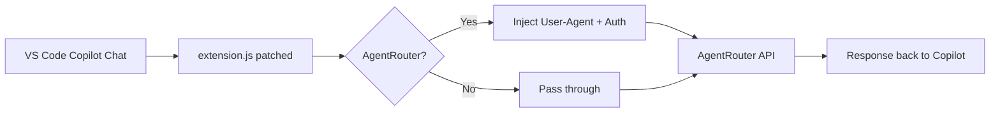

# 🤖 AgentRouter × GitHub Copilot Chat Patches

<p align="center">
  
  
  
  
</p>

<p align="center">
  
</p>

A minimal, production-ready patch set that enables **AgentRouter** models inside **GitHub Copilot Chat** for VS Code.

**✅ Tested and working with:** `glm-5.2`, `gpt-5.5`, `claude-opus-4-6`, `claude-opus-4-7`, `claude-opus-4-8`

---

## 📁 Repository

| File | Purpose |
|------|---------|
| `extension_patched.js` | ✅ **Use this** — Patched Copilot extension for new installs |
| `extension_backup.js` | 🔒 Original unpatched extension — keep for restoration |
| `chatLanguageModels.json` | 📋 AgentRouter model template — copy/paste into your existing config |
| `PATCH_SUMMARY.txt` | 📝 Patch notes and rationale |

---

## 🚀 Quick Start

<p align="center">
  
</p>

### Prerequisites

- VS Code 1.128+
- GitHub Copilot Chat extension installed
- AgentRouter API key
- Windows 10/11

---

### Step 1: Close VS Code

Ensure VS Code is **completely closed** before making any changes.

---

### Step 2: Apply the Patch

Locate your live Copilot extension file:

```
C:\Users\<your-username>\AppData\Local\Programs\Microsoft VS Code\<build>\resources\app\extensions\copilot\dist\extension.js
```

**Replace it with `extension_patched.js`** from this repository.

---

### Step 3: Add AgentRouter Models

**Do NOT overwrite your existing `chatLanguageModels.json`.**

Instead, open the repo's `chatLanguageModels.json` file and **copy only the AgentRouter provider block(s)** into your existing config at:

```
C:\Users\<your-username>\AppData\Roaming\Code\User\chatLanguageModels.json
```

The template file contains a `YOUR_API_KEY_HERE` placeholder. Replace it with your actual AgentRouter API key.

---

### Step 4: Restart VS Code

Open Copilot Chat — your AgentRouter models will now be available.

---

## 🔧 What Was Fixed

| Issue | Root Cause | Fix |
|-------|------------|-----|
| `unauthorized client detected` | `User-Agent` header was blocked by reserved headers | Removed `user-agent` from reserved header set |
| `Cannot read properties of null (reading 'usage')` | Malformed SSE chunks caused null pointer crash | Added null/object guard after JSON parsing |

<p align="center">
  
</p>

---

## 🔑 API Key Setup

### Where to Add Your Key

In `chatLanguageModels.json`, replace `YOUR_API_KEY_HERE` with your actual AgentRouter API key in **3 places** within the copied provider block:

| Location | Field | Replace |
|----------|-------|---------|
| Provider level | `apiKey` | `YOUR_API_KEY_HERE` |
| Provider level | `requestHeaders.Authorization` | `Bearer YOUR_API_KEY_HERE` |
| Each model | `requestHeaders.Authorization` | `Bearer YOUR_API_KEY_HERE` |

### Example: Adding a New Model

Use this pattern when adding custom models to your `chatLanguageModels.json`:

```json
{
  "name": "Agent Router1",
  "vendor": "customendpoint",
  "apiKey": "YOUR_API_KEY_HERE",
  "apiType": "chat-completions",
  "baseUrl": "https://agentrouter.org/v1",
  "requestHeaders": {
    "User-Agent": "claude-cli/0.0.0 (external, cli) (node/v20.0.0)",
    "Authorization": "Bearer YOUR_API_KEY_HERE"
  },
  "models": [
    {
      "id": "model-id-here",
      "name": "Display Name Here",
      "url": "https://agentrouter.org/v1",
      "toolCalling": true,
      "vision": true,
      "maxInputTokens": 1000000,
      "maxOutputTokens": 131072,
      "requestHeaders": {
        "User-Agent": "claude-cli/0.0.0 (external, cli) (node/v20.0.0)",
        "Authorization": "Bearer YOUR_API_KEY_HERE"
      }
    }
  ]
}
```

> ⚠️ **Security Note:** Never share your `chatLanguageModels.json` with others — it contains your API keys.

<p align="center">
  
</p>

---

## 🔄 How to Restore

If anything breaks or VS Code updates overwrites the patch:

1. **Close VS Code completely**
2. Copy `extension_backup.js` to:
   ```
   C:\Users\<your-username>\AppData\Local\Programs\Microsoft VS Code\<build>\resources\app\extensions\copilot\dist\extension.js
   ```
3. **Reopen VS Code**

<p align="center">
  
</p>

---

## ⚙️ How It Works

<p align="center">
  
</p>



### Patch Details

**Patch 1: Allow Custom User-Agent**
- **File:** `extension.js` → `Sl` class
- **Change:** Removed `"user-agent"` from reserved headers set
- **Result:** Custom `User-Agent` from `requestHeaders` now reaches AgentRouter

**Patch 2: Guard Malformed SSE Chunks**
- **File:** `extension.js` → `processSSEInner()`
- **Change:** Added `if (!p || typeof p !== "object") continue;`
- **Result:** Skips malformed stream chunks instead of crashing

<p align="center">
  
</p>

---

## 📋 Requirements

- VS Code 1.128+
- GitHub Copilot Chat extension
- AgentRouter API key
- Windows 10/11

---

## 🛡️ Disclaimer

<p align="center">
  
</p>

> **⚠️ For educational purposes only.**
>
> - This project modifies VS Code extension files
> - I am **not responsible** for any issues, data loss, account restrictions, or other consequences
> - This may violate GitHub's Terms of Service
> - VS Code updates may overwrite `extension.js` — re-apply the patch after updates
> - Keep `extension_backup.js` safe to restore original functionality
>
> **Use at your own risk.**

<p align="center">
  
</p>

---

## 📝 Notes

- These patches only affect **custom-endpoint / BYOK models** configured in `chatLanguageModels.json`
- They do **not** change VS Code proxy settings
- The patch allows `User-Agent` and `Authorization` headers to pass through to AgentRouter
- Other providers (OpenRouter, Anthropic, OpenAI, etc.) continue to work normally
- Always test with a low-token request first after applying patches
- Use the provided `chatLanguageModels.json` as a template — insert the AgentRouter block(s) into your existing config, don't replace the whole file

---

<p align="center">
  
</p>

<p align="center">
  Made with ❤️ for the AgentRouter community
</p>

<p align="center">
  
</p>
